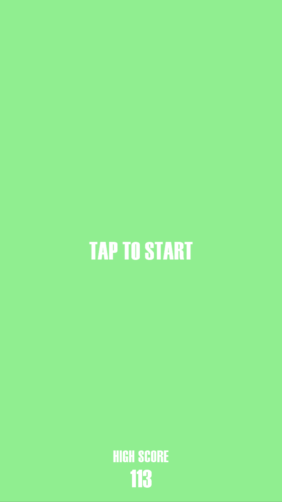
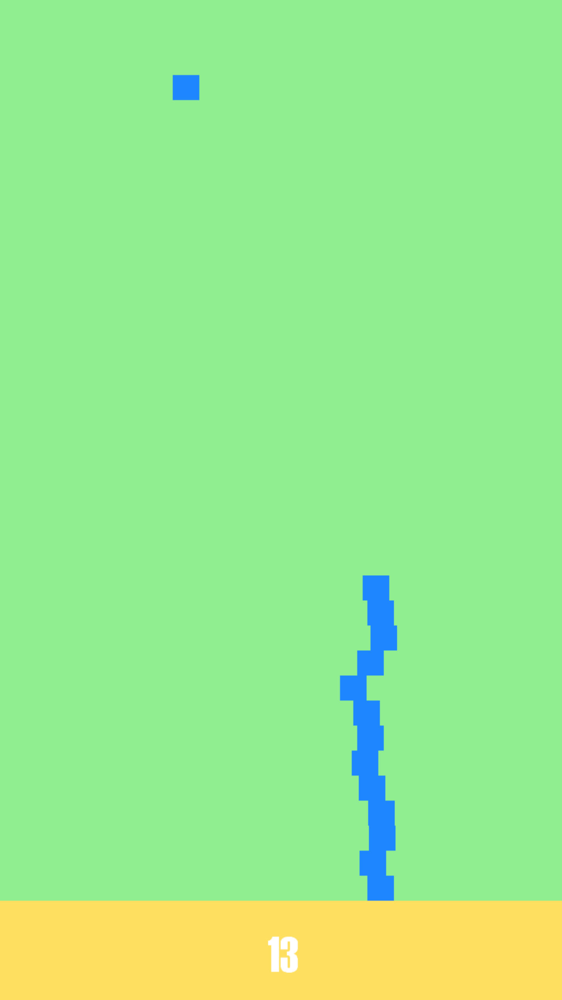

# Platform Jumper
This is the repository for the Block Stacker mini game.

Stack as many blocks as you can!
The more you stack the faster it gets.

 

## Windows
To play on Windows visit the release page [here](https://github.com/Marcus-Smallman/BlockStacker/releases).

### Controls
Space to drop the block.

## Android
To play on Android visit the Google Play store [here](https://play.google.com/store/apps/details?id=blockstacker.android.release).

### Controls
Tap anywhere on the screen to drop the block.
